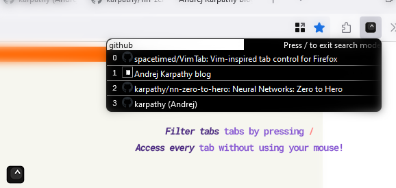

    

# VimTab (for Firefox)

Quickly navigate through hundreds of tabs with only your keyboard! (inspired by Vim)

## What does it do?

Pressing a configurable hotkey (by default `Ctrl+Alt+A`) reveals the tab switcher, displaying all tabs in "most recently used" order. 

As seen on the left of each row, keys `0-9 a-z` can be pressed to immediately swap to the desired tab, allowing to swap to up to 36 of the most recently accessed tabs. 

Additionally, one can press `/` to open the search box, and filter the list based off URL or tab titles which include a term. 

This VIM-style of navigation allows one to access any tab without ever utilizing their mouse.

## Contribution

Feel free to contribute to the project, as currently *VimTab* is in its earliest stage! 