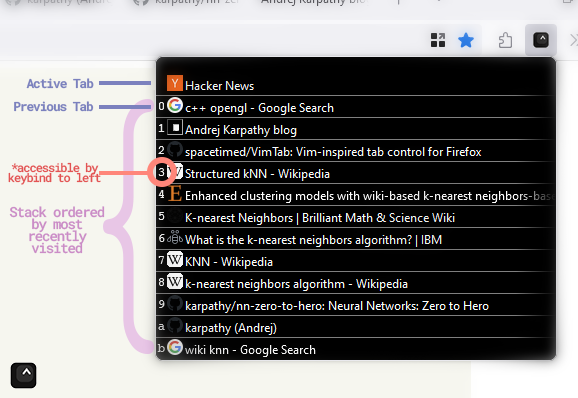

  

# VimTab (for Firefox)

Quickly navigate through hundreds of tabs with only your keyboard! (inspired by Vim)

[Available for Firefox here!](https://addons.mozilla.org/en-US/firefox/addon/vimtab/)

## What does it do?

  

  

Pressing a configurable hotkey (by default `Ctrl+Alt+A`) reveals **VimTab**:

* All listed tabs are in "recently visited" order.

* Immediately jump to a listed tab with `0-9|a-z`. *(hotkey is shown to the left of each tab entry)*

* Scroll through tab entires with `j|k`.

* Search and filter tabs with `/`. 

This Vim-inspired navigation allows you to access *any* tab without ever utilizing mouse.

## How does this help me?

*Example 1:* You have several tabs opened and quickly open a new tab to research something.

After opening the new tab, you can simply press `Hotkey+0` to immediately swap back to the original tab, and sometime later, press `Hotkey+0` to return to where you just were (because the tabs are ordered by "most recently visited" and the previously visited tab will be at index `0`).

*Example 2:* You have several tabs opened and want to go to your YouTube tab.

Press `Hotkey`, then `/`, search `youtube`, and you can arrive at your YouTube tab in under a second, without touching your mouse.

This process should offer a *significant* workflow aid for speed users in many cases. 

## Contribute

This project is currently in its earliest state so feel free to contribute!